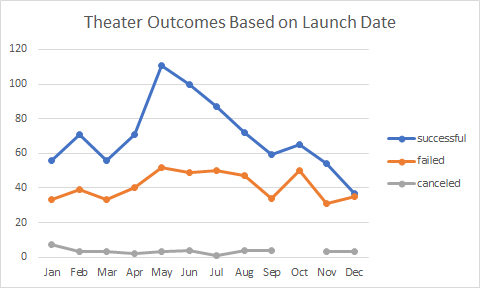
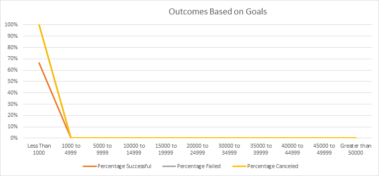

# An Analysis of Kickstarter Campaigns
Performing analysis on Kickstarter data to uncover trends
---
## Overview of Project
This Project presents a look into several thousand Kickstarter projects from across the globe.    
We are helping Louise, who is starting a Kickstarter for her play, Fever. The cost is estimated at $12,000. 
The Purpose is to present Louise with reable data at a glance. Louise wants to look at Kickstarter and how they did in relation to their launch dates as well as their funding goals. This will allow her to analyze the plays which had success, which did not, and why. 
By providing this dataset Louise can now make an informed decision on how to make her Play's Kickstarter reach its goals. 

The Kickstarter data has shown that there have been 1047 total Play campaigns. The United States and the UK had all these campaigns. 
This analysis encompasses all data in the theater category. There were a total of 1369 outcomes based on the theater category. Overall, there were 839 successful theater campaigns and 493 failed. We have broken the data into success by month. It is clear that May and June have been the most successful month in reaching there Kickstarter goals while the campaigns launched in December had the most failed.

When we take look at the data of Plays and there succusses based on goal ranges, we can see that there is actually a very small dataset for Plays with Goals close to Louise’s $12,000 goal. 
The 10000 to 14999 goal range only makes up about 75 of the outcomes out of 10457 total campaigns and about 7% of the data. 

## Results
- What are two conclusions you can draw about the Outcomes based on Launch Date?

We can conclude two things through outcomes based on launch date that May and June have the most successful number of outcomes and that December has the most unsuccessful outcomes. If Louise would a better chance at success, she should hold her Kickstarter in the Spring rather than Winter. 

- What can you conclude about the Outcomes based on Goals?

Outcomes based on Goals, here we can conclude the in general the more expensive the play the less likely the Kickstarter is to succeed. More than half of the plays were successful but there were very few plays with Goals as high as Louise's goal.
 
- What are some limitations of this dataset?

There were a few limitations with the dataset we were working with. For one, there were as many Kickstarter plays as some other categories. In Outcomes based on goals, the data set doesn't have a wide amount of info based on each Goal range. 
Louise is in the 10000 to 14999 categories. This category has a smaller data set. If we had a larger category of data in this range, we could more elimate erroneous data markers and break it down in a more digestible and accurate way. 

- What are some other possible tables and/or graphs that we could create?

Another possible place where we could expand into more is in the Outcomes based on goals.
I think we can break down this data further and investigate how many plays in each Goal range group were successful, failed, or canceled. 
From there we can calculate the percentage of plays in each Goal range group that were successful, failed or canceled. 
We also have an opportunity to break this down into descriptive statistics such as Mean Goal, Median Goal, Standard Deviation etc... We can break it down to the average goal among Kickstarter to compare their budget to Louise's.  
Looking at the data like this will allow Louise to see which Goal had the most success and the most failure. 
She can then compare these rates of success and failure to where her play Goal range lands.

